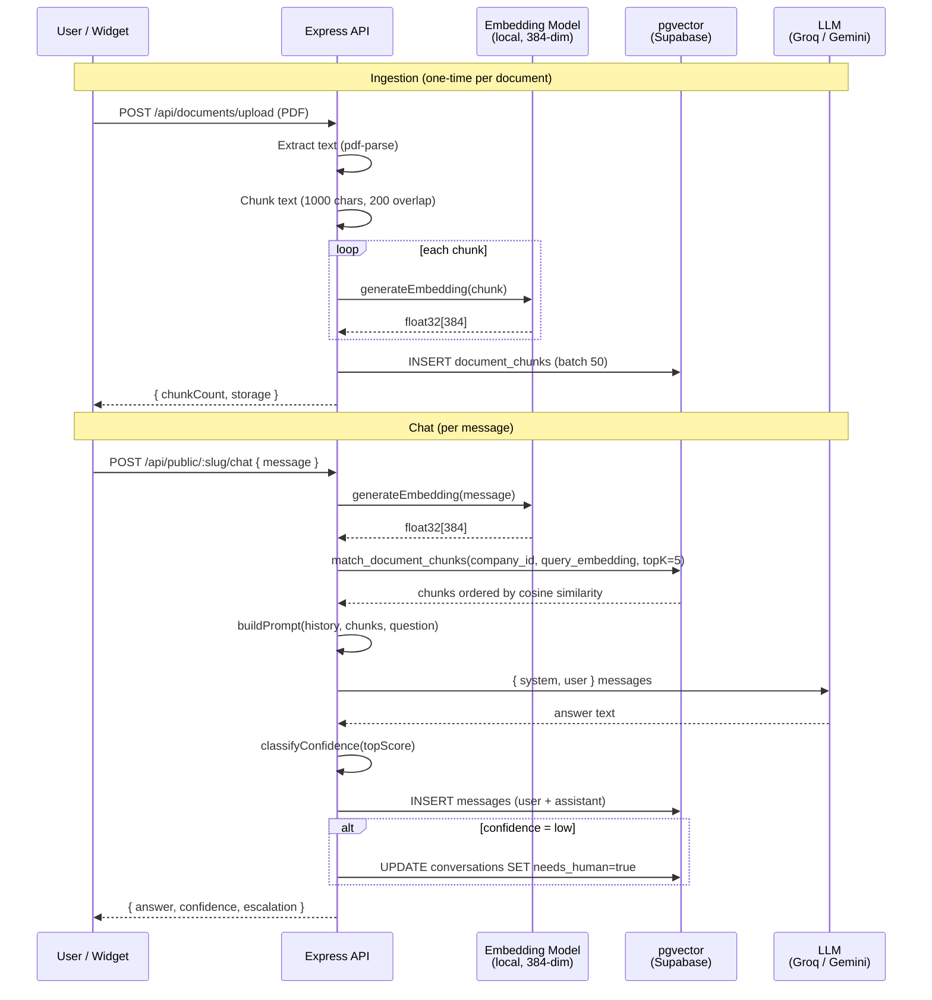
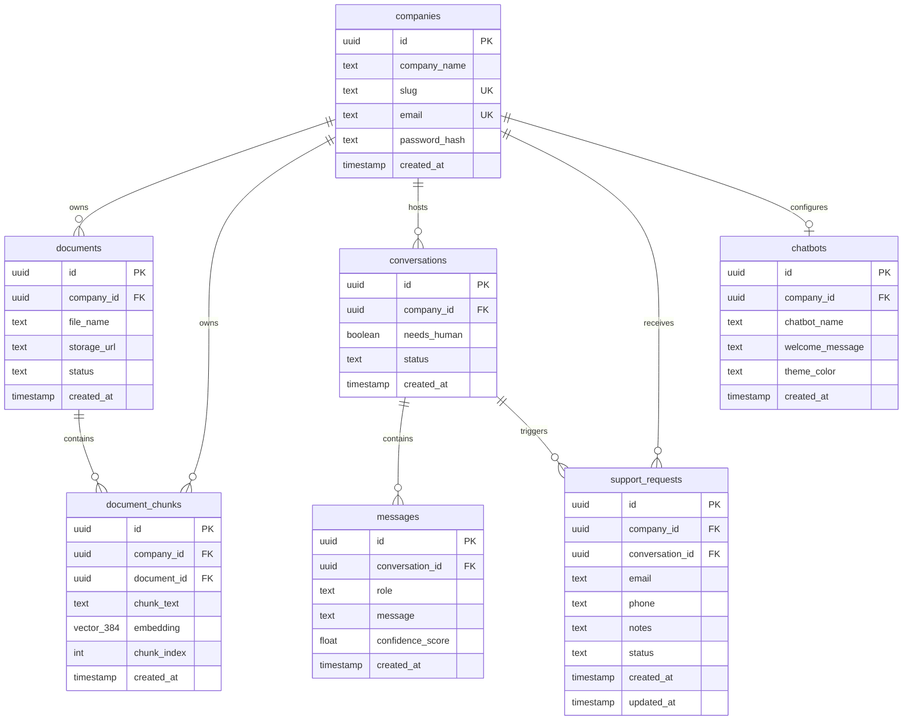

# 🐝 SupportBee

> AI-powered customer support backend — RAG pipeline, multi-tenant, plug-and-play embeddable widget.

[](https://nodejs.org)
[](https://expressjs.com)
[](https://supabase.com)
[](#embeddings)
[](#testing)
[](#license)

Companies upload their support documents. Customers ask questions in a chat widget. SupportBee retrieves the most relevant document chunks using vector similarity, grounds the LLM answer in real company data, and escalates to a human when confidence is low.

---

## Table of Contents

- [How it works](#how-it-works)
- [Architecture](#architecture)
- [RAG Pipeline](#rag-pipeline)
- [Database Schema](#database-schema)
- [API Overview](#api-overview)
- [Tech Stack](#tech-stack)
- [Getting Started](#getting-started)
- [Environment Variables](#environment-variables)
- [Migrations](#migrations)
- [Confidence & Escalation](#confidence--escalation)
- [Testing](#testing)
- [Project Structure](#project-structure)

---

## How it works

```
Company uploads PDF  →  Text extracted  →  Chunked (1k chars, 200 overlap)
                                           ↓
                                    Embedded locally
                                 (all-MiniLM-L6-v2, 384-dim)
                                           ↓
                                  Stored in pgvector

Customer asks question  →  Query embedded  →  cosine similarity search
                                                  ↓
                                          Top-K chunks retrieved
                                                  ↓
                                     Prompt built (system + history + context + question)
                                                  ↓
                                    LLM answers (Groq / Gemini)
                                                  ↓
                             Confidence scored  →  low? escalate to human
```

---

## Architecture

```mermaid
graph TB
    subgraph Clients
        W[Embeddable Widget<br/>any origin]
        D[Dashboard<br/>company.app.com]
    end

    subgraph Express API
        H[GET /health]
        subgraph Public Routes — CORS *
            P1[GET /api/public/:slug/info]
            P2[POST /api/public/:slug/chat]
            P3[POST /api/public/:slug/support-request]
        end
        subgraph Authenticated Routes — CORS restricted
            A1[POST /api/auth/register]
            A2[POST /api/auth/login]
            A3[GET  /api/auth/me]
            DOC[POST /api/documents/upload<br/>GET  /api/documents<br/>DELETE /api/documents/:id]
            C1[POST /api/chat<br/>GET  /api/chat/conversations<br/>GET  /api/chat/conversations/:id]
            SR[GET  /api/support-requests<br/>PATCH /api/support-requests/:id]
        end
    end

    subgraph Services
        RAG[RAG Pipeline<br/>chatFlow.js]
        ING[Ingestion<br/>processDocument.js]
        EMB[Embeddings<br/>Xenova / local]
        LLM[LLM<br/>Groq · Gemini]
        SIM[Similarity Search<br/>pgvector RPC]
    end

    subgraph Storage
        SB[(Supabase<br/>PostgreSQL + pgvector)]
        ST[(Supabase Storage<br/>documents bucket)]
    end

    W -->|widget CORS *| P2
    D -->|dashboard CORS| A1 & A2 & A3 & DOC & C1 & SR

    P2 --> RAG
    C1 --> RAG

    RAG --> EMB
    RAG --> SIM
    RAG --> LLM

    DOC --> ING
    ING --> EMB
    ING --> ST

    SIM --> SB
    ING --> SB
    RAG --> SB
    A1 & A2 & A3 --> SB
    SR --> SB
```

---

## RAG Pipeline



---

## Database Schema



**Document status lifecycle:**
```
INSERT → status='processing'
         ↓  (storage upload success)
         status='processed'
```

**Conversation status lifecycle:**
```
CREATE → status='active'
         ↓  (confidence = low)
         status='escalated', needs_human=true
```

**Support request status lifecycle:**
```
CREATE → status='pending'
         ↓  (company resolves)
         status='resolved' | 'closed'
```

---

## API Overview

Full reference: [`docs/api.md`](docs/api.md)

### Public (widget — CORS `*`)

| Method | Path | Description |
|--------|------|-------------|
| `GET` | `/api/public/:slug/info` | Company info by slug |
| `POST` | `/api/public/:slug/chat` | Send message, get AI answer |
| `POST` | `/api/public/:slug/support-request` | Escalate to human agent |

### Auth

| Method | Path | Auth | Description |
|--------|------|------|-------------|
| `POST` | `/api/auth/register` | — | Create company account |
| `POST` | `/api/auth/login` | — | Get JWT token |
| `GET` | `/api/auth/me` | JWT | Current company profile |

### Documents

| Method | Path | Auth | Description |
|--------|------|------|-------------|
| `POST` | `/api/documents/upload` | JWT | Upload PDF (multipart) |
| `GET` | `/api/documents` | JWT | List company documents |
| `DELETE` | `/api/documents/:id` | JWT | Delete document |

### Chat (dashboard)

| Method | Path | Auth | Description |
|--------|------|------|-------------|
| `POST` | `/api/chat` | JWT | Send message |
| `GET` | `/api/chat/conversations` | JWT | List conversations |
| `GET` | `/api/chat/conversations/:id` | JWT | Conversation detail + messages |

### Support Requests

| Method | Path | Auth | Description |
|--------|------|------|-------------|
| `GET` | `/api/support-requests` | JWT | List requests |
| `PATCH` | `/api/support-requests/:id` | JWT | Update status |

---

## Tech Stack

| Layer | Technology | Why |
|-------|-----------|-----|
| Runtime | Node.js 20+ (ESM) | Native `node:test`, top-level await |
| Framework | Express 5 | Async error propagation built-in |
| Database | Supabase (PostgreSQL) | Managed Postgres + storage + auth |
| Vector search | pgvector (`VECTOR(384)`) | Native cosine similarity in SQL |
| Embeddings | `@xenova/transformers` — `all-MiniLM-L6-v2` | Local inference, no API key, 384 dims |
| LLM — Groq | `llama-3.1-8b-instant` | Fast, cheap, good for support |
| LLM — Gemini | `gemini-2.0-flash` | Fallback / alternative |
| Auth | JWT HS256 (7-day) | Stateless, company-scoped |
| Storage | Supabase Storage | Same project, public-URL bucket |
| File parsing | `pdf-parse` 2.4.5 | In-memory, no disk writes |
| CORS | Split: `*` for widget, restricted for dashboard | Widget embeds on any site |

---

## Getting Started

### Prerequisites

- Node.js 20+
- A [Supabase](https://supabase.com) project with pgvector enabled
- At least one LLM API key (Groq or Gemini)

### 1 — Clone & install

```bash
git clone https://github.com/your-org/supportbee
cd supportbee/backend
npm install
```

### 2 — Configure environment

```bash
cp ../.env.example .env
# Edit .env with your actual values
```

### 3 — Apply database migrations

Run these in order in your Supabase SQL Editor:

```bash
# 1. Core schema
migrations/001_initial_schema.sql

# 2. Conversation status column
migrations/002_add_conversation_escalation.sql

# 3. Support requests table
migrations/003_add_support_requests.sql

# 4. Fix embedding dimension (run on existing installs)
migrations/004_fix_embedding_dimension.sql
```

Full guide: [`docs/database.md`](docs/database.md)

### 4 — Start

```bash
npm run dev    # nodemon, hot-reload
npm start      # production
```

The server listens on `PORT` (default `5000`). Check it:

```bash
curl http://localhost:5000/health
# {"status":"ok","service":"supportbee-backend"}
```

---

## Environment Variables

| Variable | Required | Description |
|----------|----------|-------------|
| `SUPABASE_URL` | Yes | Your Supabase project URL |
| `SUPABASE_SERVICE_ROLE_KEY` | Yes | Service role key (bypasses RLS) |
| `JWT_SECRET` | Yes | HS256 signing secret (min 32 chars) |
| `GROQ_API_KEY` | One of these | Groq LLM key |
| `GEMINI_API_KEY` | One of these | Google Gemini key |
| `LLM_PROVIDER` | No | `groq` (default) or `gemini` |
| `GROQ_MODEL` | No | Default: `llama-3.1-8b-instant` |
| `GEMINI_MODEL` | No | Default: `gemini-2.0-flash` |
| `CORS_ORIGIN` | No | Dashboard origin (default `*` in dev) |
| `PORT` | No | Server port (default `5000`) |
| `CONFIDENCE_HIGH_THRESHOLD` | No | Float 0–1, default `0.8` |
| `CONFIDENCE_MEDIUM_THRESHOLD` | No | Float 0–1, default `0.6` |

See [`.env.example`](.env.example) for a ready-to-copy template.

---

## Migrations

| File | Description |
|------|-------------|
| `001_initial_schema.sql` | Core tables, pgvector, `match_document_chunks` RPC (`VECTOR(384)`) |
| `002_add_conversation_escalation.sql` | `conversations.status` column + indexes |
| `003_add_support_requests.sql` | `support_requests` table, unique constraint, auto-`updated_at` trigger |
| `004_fix_embedding_dimension.sql` | **Live-DB patch** — truncates stale chunks, alters column `768→384`, recreates RPC |

Full details: [`docs/database.md`](docs/database.md)

---

## Confidence & Escalation

Every chat response is scored based on the cosine similarity of the top retrieved chunk.

```
topScore  ≥ 0.80  →  level = "high"   → state = "active"
topScore  ≥ 0.60  →  level = "medium" → state = "active"
topScore  <  0.60  →  level = "low"    → state = "escalated"
                                          needs_human = true
```

Thresholds are configurable via `CONFIDENCE_HIGH_THRESHOLD` and `CONFIDENCE_MEDIUM_THRESHOLD`.

When escalated, the conversation's `needs_human` flag is set and the dashboard shows it in the escalated queue. Customers can also manually submit a support request (with email/phone) via `POST /api/public/:slug/support-request`.

---

## Testing

```bash
cd backend
npm test
```

23 smoke tests, zero external dependencies needed. Uses Node's built-in `node:test` runner.

| Suite | Coverage |
|-------|----------|
| `extractText` | PDF parser API |
| `chunkText` | Overlap, empty input |
| `embedding module exports` | Re-export shape |
| `companyLookup` | UUID fallback removed |
| `requireAuth` | Missing token, bad JWT, valid JWT |
| `document status values` | processing → processed lifecycle |
| `buildPrompt` | Structured `{system, user, full}` |
| `groq provider source` | Structured message format |
| `gemini provider source` | `systemInstruction` wiring |
| `isMissingColumnError` | 5 cases, PGRST204 rejection |
| `evaluateEscalation` | low/high/numeric score |
| `migration 004` | SQL ordering and dimension |

---

## Project Structure

```
backend/
├── migrations/
│   ├── 001_initial_schema.sql         # Core tables + pgvector RPC
│   ├── 002_add_conversation_escalation.sql
│   ├── 003_add_support_requests.sql
│   └── 004_fix_embedding_dimension.sql
│
└── src/
    ├── app.js                         # Express app, split CORS
    ├── server.js                      # HTTP server, dotenv
    │
    ├── db/
    │   └── supabase.js                # Singleton client, fail-fast on missing env
    │
    ├── middleware/
    │   ├── auth.middleware.js          # requireAuth (JWT), requireCompanyId
    │   └── error.middleware.js         # 404 + global error handler
    │
    ├── routes/
    │   ├── auth.routes.js
    │   ├── chat.routes.js
    │   ├── document.routes.js
    │   ├── public.routes.js
    │   └── supportRequest.routes.js
    │
    ├── controllers/
    │   ├── auth.controller.js          # register, login, me
    │   ├── chat.controller.js          # createChat, listConversations, getConversation
    │   ├── document.controller.js      # uploadDocument, listDocuments, deleteDocument
    │   ├── public.controller.js        # getPublicCompanyInfo, sendPublicChat, createPublicSupportRequest
    │   └── supportRequest.controller.js
    │
    ├── services/
    │   ├── chat/
    │   │   ├── chatFlow.js             # Orchestrates RAG → LLM → persist
    │   │   ├── confidence.js           # Score classification (high/medium/low)
    │   │   ├── conversationAdmin.js    # Paginated conversation listing
    │   │   ├── conversationMemory.js   # getOrCreate + recent messages
    │   │   ├── escalation.js           # evaluateEscalation, persistConversationEscalation
    │   │   ├── persistChatTurn.js      # INSERT user + assistant messages
    │   │   └── schemaCompatibility.js  # isMissingColumnError (graceful schema fallback)
    │   │
    │   ├── embeddings/
    │   │   ├── index.js               # Provider router
    │   │   └── providers/
    │   │       ├── local.js           # Xenova all-MiniLM-L6-v2 (384-dim)
    │   │       └── gemini.js          # Gemini embedding API
    │   │
    │   ├── ingestion/
    │   │   ├── extractText.js         # pdf-parse → text
    │   │   ├── chunkText.js           # Sliding window chunker
    │   │   ├── generateEmbeddings.js  # Re-exports from embeddings/index
    │   │   ├── processDocument.js     # Extract → chunk → embed (Promise.allSettled)
    │   │   └── saveDocumentChunks.js  # Batched INSERT (50/batch)
    │   │
    │   ├── llm/
    │   │   ├── generateResponse.js    # Provider dispatcher
    │   │   ├── index.js
    │   │   └── providers/
    │   │       ├── groq.js            # Groq fetch — {system, user} messages
    │   │       └── gemini.js          # @google/genai — systemInstruction + contents
    │   │
    │   ├── retrieval/
    │   │   ├── buildPrompt.js         # Returns {system, user, full}
    │   │   ├── companyLookup.js       # Slug-only lookup (no UUID fallback)
    │   │   ├── generateQueryEmbedding.js
    │   │   ├── retrieveChunks.js
    │   │   └── similaritySearch.js    # pgvector RPC + JS cosine fallback
    │   │
    │   ├── storage/
    │   │   └── uploadToSupabase.js    # Upload → public URL; throws on failure
    │   │
    │   └── support/
    │       └── supportRequest.service.js
    │
    ├── utils/
    │   ├── companyScope.js
    │   └── ragDebug.js                # Structured RAG tracing
    │
    └── __tests__/
        └── smoke.test.js              # 23 tests, node:test, no extra deps
```

---

## Docs

| Document | Contents |
|----------|----------|
| [`docs/architecture.md`](docs/architecture.md) | System design, data flows, design decisions |
| [`docs/api.md`](docs/api.md) | Full API reference with request/response examples |
| [`docs/database.md`](docs/database.md) | Schema details, migration guide, index strategy |

---

## License

ISC
